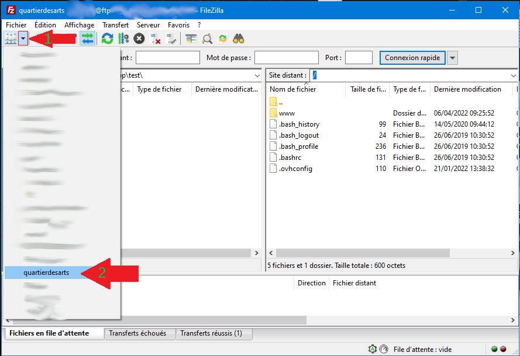
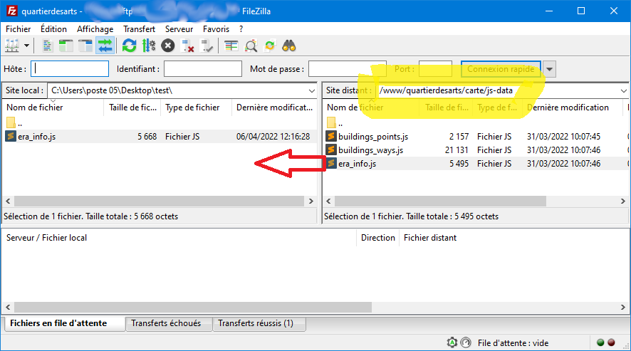
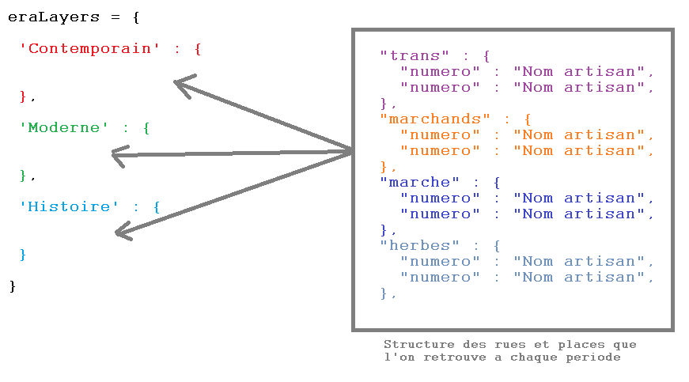
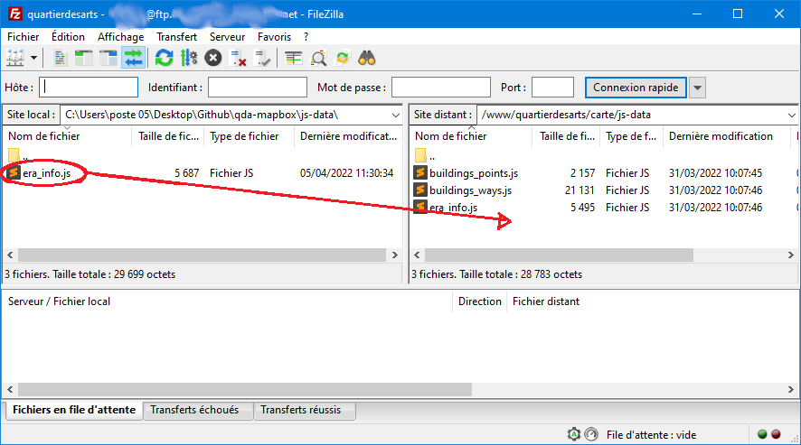

Document pour la carte en 3D avec Géolocalisation
===

https://www.draguignan-quartierdesarts.fr/carte

Partie I - Tutoriel pour ajouter un artisan
===

Prérequis - Accès FTP
---
Pour mettre à jour les artisans sur les différents numéros il faut tout d'abord **avoir accès au serveur.**
Nous utilisons FTP (un protocole réseau qui permet de transférer des fichiers de votre pc vers le serveur, ou l'inverse : de récupérer les fichiers du serveur pour les mettre sur votre pc).
**Le logiciel Filezilla permets d'utiliser FTP très facilement.**

Vous avez besoin des éléments fournis par OVH : 
1.  l'**adresse** pour accéder au service FTP du serveur.
2. le **nom d'utilisateur** et le **mot de passe** pour la connexion.

> *Ces informations peuvent être retrouvées facilement sur Filezilla sur le POSTE 05.
(en favori dans le gestionnaire de sites)*

Naviguer sur le serveur - Récupérer le bon fichier
---
1. Une fois connecté il faut aller dans 📁`/www/quartierdesarts/carte/js-data`.

2. Télécharger et éditer (ouvrir) le fichier 📄`era_infos.js`.

Ajouter un numéro interactif (Artisan ou info historique)
---
**Dans le fichier 📄`era_info.js` ce qui nous intéresse est entre les accolades `{` et `}` après `eraLayer` à partir de la ligne 15.**
> On peut ignorer les premières lignes (`const`, `streets = [...]`,  etc).
On peut lire les notes en commentaire : tout ce qui est entre `/*  */`.

1. Aller à la période voulue puis trouver la rue pour laquelle on veut ajouter un numéro.

2. Ajouter une ligne *en respectant la syntaxe*. La ligne doit contenir le numéro et le texte à afficher au survol du bâtiment.
>__Par exemple__ : 
`  "02" : "maison Truc",  `
la virgule de fin de ligne **est très importante**.

> __Imbrication__ : *On peut imager la structure du code comme des boites dans des boites.
Les numéros sont rangés par rues, et on retrouve cette structure pour chaque période.*

>__Cohérence__ : Ces "boites" sont délimites par des accolades qui fonctionnent par paires : à une ouvrante correspond une fermante.
Elle ne peuvent pas se croiser, c'est a dire qu'une fermante correspond toujours a l'ouvrante précédente.

3. Enregistrer le fichier

4. Déposer le fichier sur le serveur après enregistrement.
>Utilisez FilleZilla et allez dans 📁`/www/quartierdesarts/carte/js-data`. Faites glisser déposer puis valider le remplacement du fichier.

PARTIE II - Infos pour les Développeurs
===
Notes
---
 * Attention en JS les tableaux associatifs sont des `object` et non des `array` (pas de méthode `forEach`).
 * dans le code `era` se traduit en français par `période`.
 * un `Node` est un tuple longitude-latitude (en clair c'est un point géographique)
 >Ça se présente sous la forme d'un Array en JS et JSON : `[lon, lat]`
 Il faut respecter l'ordre : longitude en premier.
 * un `Way` est une liste de `Nodes`. sous la forme :
   `[[ [lon1, lat1], [lon2, lat2], [lon3, lat3], [lon1, lat1] ]]`
 >Notez l'utilisation d'un double crochet au début et a la fin. Aussi nos tracés seront tous fermés, donc on mets le même point au début et à la fin. L’exemple donné est donc un triangle, pas un quadrilatère.

Arborescence du projet
---
Les **scripts** sont repartis en **3 dossiers** dont le nom commence par le préfixe `js`

* **📁`js-data`** : contient les données nécessaire pour construire les sources et les layers.

  - **📄`era_info.js`** : fait correspondre pour chaque période les numéros des rues (bâtiments) aux infos historiques (occupants)

  il y a un tableau `streets` qui répertorie les rues.

  il y a un tableau associatif multidimensionnel `eraLayers` qui permets d’établir la correspondance précédemment citée.

  l'imbrication est sous cette forme :
   ` eraLayers[epoque][rue][numero] -> "attribut title au survol" `

  - les fichiers 📄`buildings_points.js` _**OU**_ 📄`buildings_ways.js` :
    + **📄`buildings_points.js`**
   Permets d'associer chaque bâtiment à un tuple [lon, lat] qui permets d'afficher une pastille en leur centre.
   (n'est plus utilisé. On le garde au cas ou on ne veut plus les ways.)
   
    + **📄`buildings_ways.js`**
   Le second utilise une liste de tuples [lon, lat] permettant de délimiter entièrement le bâtiment.
   (c'est un **Path SVG**, le nom **way** provient de la nomenclature OSM et Mapbox).
   Cela permets d'avoir un effet de hover sur la totalité batiment.
     >ces fichiers sont mutuellement exclusifs. Ne pas inclure les 2 sur la page index.html.
  Actuellement nous utilisons `buildings_ways.js`.

* **📁`js-helper` :**
contient des fonctions de construction pour éviter les répétitions de code.

  - **📄`data_utils.js` :**
  permets de parcourir le tableau `eraLayers` et de créer les "sources" mapbox (collection de "features" avec la syntaxe propre a GeoJSON).

  - **📄`mapbox_utils.js` :**
  fonctions pour ajouter les sources et paramétrer les layers correspondants (identifiants, codes couleur etc...).

  - **📄`mapbox_popup.js` :**
  instancie le popup (élément HTML masqué). Fonctions pour afficher et masquer de nouveau.

 * **📁`js-main` :**
 contient les scripts principaux

   - **📄`function.js` :**
  Fonctions principales. Pour l'instant ce fichier contient la fonction `populateNavMenu()` qui permets de créer les 3 boutons colorés en haut a gauche. Ces boutons permettent de choisir le layer (la période) que l'on veut afficher.

   - **📄`main.js` :**
  Le "point d'entrée". Ici on a une brève procédure de calcul du zoom et de l'orientation (s'adapte a la taille de l’écran et a son orientation) puis **on instancie la map**.
  On ajoute des contrôles (pour le zoom et l'orientation) puis `on idle` on vérifie la présence des layers avant d'appeler la fonction de construction du menu.

   - **📄`onload.js` :**
  se declanche **apres** l'instanciation de la carte mais **avant** `on idle`.
  Charge les sources et Layers associés. Associe les évènement `mouseleave` et `mouseenter` aux fonctions de popup.

Résolution de Problème
===
Problème d'affichage
---
Si ça ne marche pas (le bâtiment ajouté ne s'affiche pas, ou pire : plus aucun ne s'affiche voir même la page blanche !) alors :
- vérifier qu'il ne manque pas une virgule de fin de ligne dans le tableau.
-  ajouter le bâtiment manquant dans 📄`buildings_ways.js`. (en principe ils y sont tous sauf le _5 rue de trans_...)

Problème de lien
---
Pour que la carte fonctionne bien il faut s'assurer que tous les permaliens des articles "numéros" sur le site Wordpress respectent la convention de nommage.

Le modèle à suivre est : `n-00rue`
>exemple : https://www.draguignan-quartierdesarts.fr/n-03trans/
1. remplacer `00` par le numéro de rue concerné.
> si inférieur à 9, préfixer un zéro.
> exemples : 01, 02,... 09, 10
2. remplacer `rue` par le nom de la rue ou de la place, parmi les suivant : 
	- `trans` pour la rue de trans
	- `marchands` pour la rue des marchands
	- `marche` pour la place du marché
	- `herbes` pour la place aux herbes.

On peut changer un permalien sur le backoffice : tout en haut de la page on clique sur modifier a côté du lien. A modifier uniquement si le modèle ci-dessus n'est pas respecté.

Géométrie des bâtiments
---
Vous pouvez utiliser https://overpass-turbo.eu/ pour récupérer la liste des `Nodes` (points) du contour d'un bâtiment.
Ce site n'est pas facile a utiliser pour un débutant, mais c'est l'outil le plus pratique que j'ai trouvé.

#### Requête Overpass-turbo - fonctionnement de l'Encadrement :
Pour vous faciliter la vie voici une requête qui récupère les bons bâtiments (ceux du quartier et ses alentours) :

` way(43.53683327522896, 6.465939466740622, 43.53902059106164, 6.468409571101574)[building=yes];
(._;>;);
out;`

La requête récupère tous les **Ways** de type **Building**, dans le cadre délimité par l'encadrement : `43.53683327522896,6.465939466740622, 43.53902059106164,6.468409571101574`.
>Le cadre commence toujours par la latitude la plus basse, suivie par la longitude la plus basse, puis la latitude la plus haute, suivie de la longitude la plus haute.

En clair on peu résumer comme cela : point Sud-Ouest, point Nord-Est
avec pour chaque point la latitude avant la longitude.
>on défini une diagonale dans ce sens : "/" en commençant par le bas et nous avons notre cadre (Bounding Box en anglais).

voici la **doc** pour l'**API** (a lire avant) : https://wiki.openstreetmap.org/wiki/Overpass_API
voici la **doc** pour la **syntaxe** ⚠️ _hic sunt dracones_ 🐉 : https://wiki.openstreetmap.org/wiki/Overpass_API/Language_Guide

#### Exporter les resultats de la requette

Cette requette revoie des batiments dont nous n'avons pas besoin.
Vous pouvez exporter la liste des resultats sous forme d'XML ou de GeoJSON.
Ensuite, dans cette liste, on peut trier par `id` ceux que l'on veut conserver.
On peut voir l'`id` d'un `way` sur l'interface web en cliquant sur le polygone (pop-in).
Il suffit de copier et rechercher dans le fichier exporté pour ne garder que le nécéssaire.

#### Éditer un `Way` (polygone) - ensemble de `Nodes` (point) pour le contour des bâtiments
Si deux numéros sont fusionnés (considéré comme un seul bâtiment sur OSM)
> Exemple : le bâtiment des _caboch'arts_

Ou si l'on cherche a recréer un bâtiment du passé qui a été détruit mais qui se trouve entre deux autres bâtiments
> Exemple : le _numéro 32 rue de trans_ est maintenant _la Traverse du palais_.

alors il faut éditer la liste des coordonnées en se basant sur les bâtiments voisins.
Ce n'est pas évidant a première vue, mais avec un peu d'astuce on peut s’épargner des difficultés.
>Le problème vient de la complexité des nombres représentant les latitudes et longitudes, en plus du fait que les distances entre les points considérés soit très courtes. Seules les décimales les moins significatives changent et la comparaison sur une longue liste n'est pas triviale.

On peut supprimer temporairement un `Node` en enlevant une ligne "latitude - longitude" sur un bâtiment et observer le résultat sur le navigateur. (le polygone perds un sommet : vous avez identifié le point).
En procédant par élimination on peut trouver les points que l'on veut utiliser pour créer un autre bâtiment.

>**Attention** : dans notre application un `Way` finira toujours par le même `Node` que celui par lequel il a commencé (ce sont des polygones fermés).

